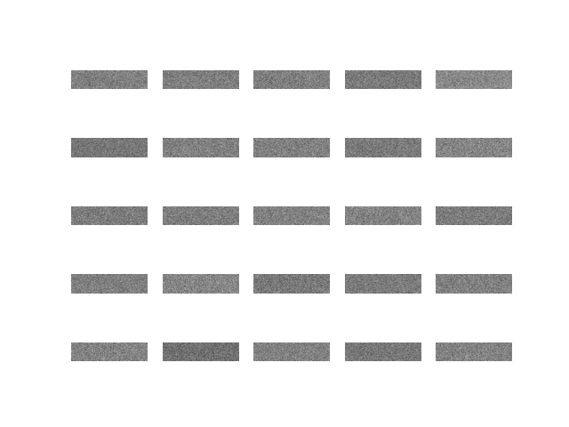
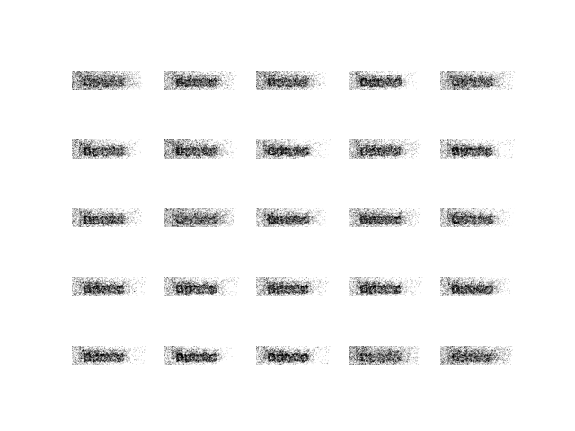
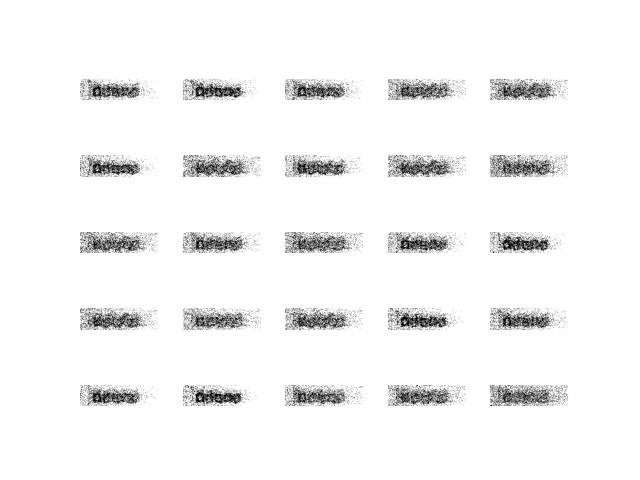

# GAN을 활용한 CAPCHA 생성기

CAPCHA를 생성하는 GAN 모델 구현. CAPCHA 데이터는 [Kaggle](https://www.kaggle.com/fournierp/captcha-version-2-images)에서 구함.
### Version 1: 기본적인 GAN 구조
Generator와 Discriminator를 간단한게 구현. MNIST 데이터를 효과적으로 생성한 GAN 구조보다 Generator와 Discriminator를 Layer 한개씩 더 쌓았다. 

결과는 처참한 실패.

**시작 단계**

**5,000회 반복**

**10,000회 반복**

만약 이런식으로 캡차를 생성하면 사람도 못 풀 것이다. 

우선 데이터를 통해 중간에 글씨가 집중적으로 배치된느 것을 학습한 듯하다. 하지만 구체적인 글씨체(알파벳, 숫자)를 나타내는 것에는 무리가 있다. MNIST는 나름 잘 학습되었는데 캡차가 학습되지 않은 이유는 무엇일까. 원인으로는 다음과 같은 것을 생각할 수 있다.

1) 데이터로 인해 발생한 문제이다.
   * 데이터의 수가 부족하다. MNIST 데이터에 비해서 현저하게 부족한 수의 데이터이다. MNIST는 총 55,000 개에 데이터가 있는 반면 Kaggle에서 제공하는 캡차의 수는 1070개에 불과하다. 
   * 데이터의 크기가 너무 크다. MNIST 데이터는 28x28이지만 캡차는 50*200으로 픽셀 수가 많으며 심지어 정방형에 데이터도 아니다
   * MNIST는 
2) 모델의 문제이다
   * MNIST는 단순하기 때문에 GAN 구현에 있어서 FC를 사용했지만 캡차는 다소 복잡하므로 CNN을 사용하는 것이 나을 수 있다.
   * GAN은 일정한 성능을 보장하지 않는다. 따라서 캡차를 생성하는 것이 아니라 입력된 캡차와 유사한 무언가를 만드는 것이 목적이라면 VAE를 사용하는 것이 나을 수 있다.

GAN을 활용한 캡차 생성 논문이 상당한 것을 확인할 수 있다. 이러한 논문에서도 결국 CNN을 기반으로 GAN을 구축하였으며, 데이터의 수도 훨씬 많았다. 결국 캡차 생성을 위해서는 데이터 확보와 CNN 기반의 GAN 구축이 필요하다.